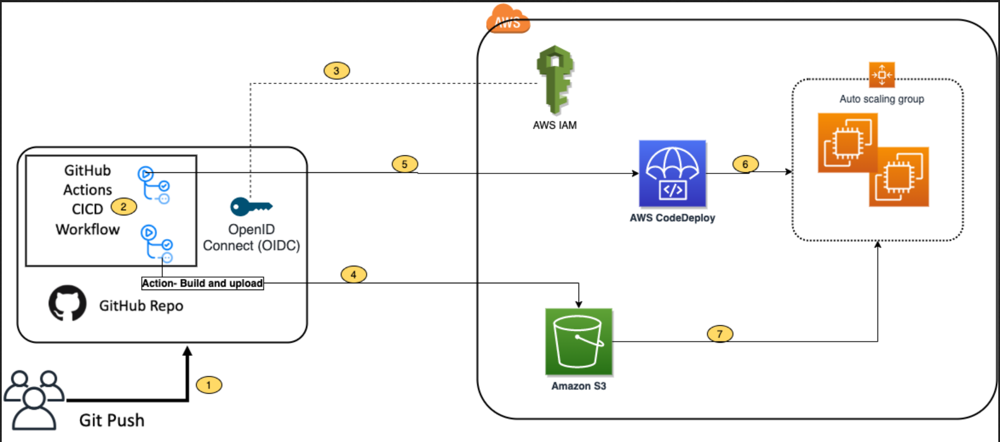
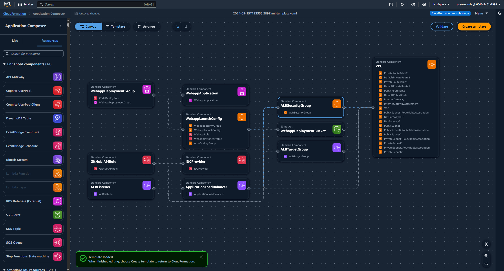
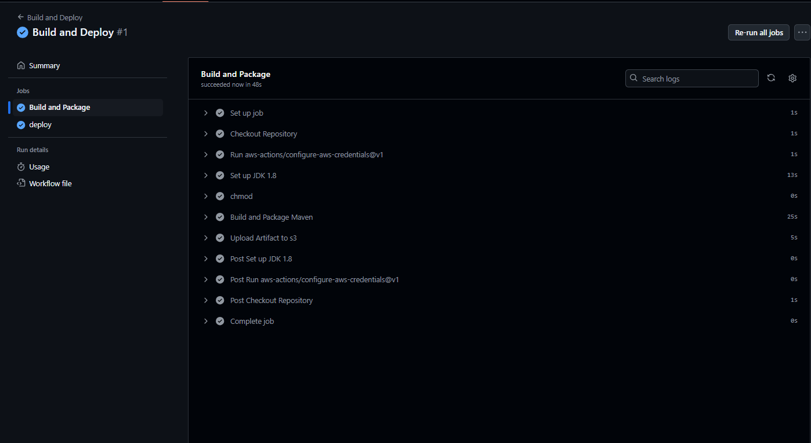
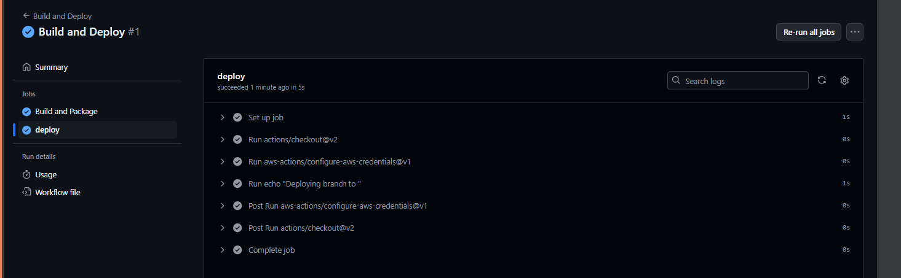
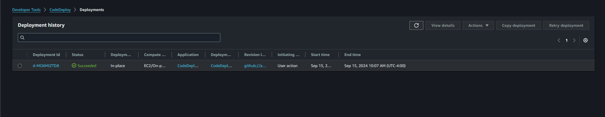
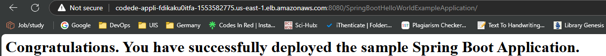

# Integrating with GitHub Actions – CICD pipeline to Deploy a Web App to Amazon EC2. 

In this repo, using GitHub Actions to create a CI/CD workflow and AWS CodeDeploy to deploy a sample Java SpringBoot application to Amazon Elastic Compute Cloud (Amazon EC2) instances in an Autoscaling group.

## Overview

The steps include:
1. GitHub Actions : Workflow Orchestration tool that will host the Pipeline.
2. AWS CodeDeploy : AWS service to manage deployment on Amazon EC2 Autoscaling Group.
3. AWS Auto Scaling : AWS Service to help maintain application availability and elasticity by automatically adding or removing EC2 instances.
4. Amazon EC2 : Destination Compute server for the application deployment.
5. AWS CloudFormation : AWS infrastructure as code (IaC) service used to spin up the initial infrastructure on AWS side.
6. IAM OIDC identity provider : Federated authentication service to establish trust between GitHub and AWS to allow GitHub Actions to deploy on AWS without maintaining AWS Secrets and credentials.
7. Amazon S3 : Amazon S3 to store the deployment artifacts.

The illustration of the architecture for this repo can be showed as:



## Walkthrough

The following steps provide a high-level overview of the walkthrough:
1. Clone the project from the AWS code samples repository.
2. Deploy the AWS CloudFormation template to create the required services.
3. Update the source code.
4. Setup GitHub secrets.
5. Integrate CodeDeploy with GitHub.
6. Trigger the GitHub Action to build and deploy the code.
7. Verify the deployment.



### 1. Clone the project from the AWS code samples repository.
``` git clone https://github.com/aws-samples/aws-codedeploy-github-actions-deployment.git ```

And move/copy to the local repo so that it can be pushed to the personal repo in GitHub.

### 2. Deploy the AWS CloudFormation template to create the required services.

To deploy the CloudFormation template, by following the below steps.

```
1.	Open AWS CloudFormation console. Enter account ID, user name and Password. 
2.	Check region, this solution uses us-east-1.
3.	If this is  new AWS CloudFormation account, click Create New Stack. Otherwise, select Create Stack.
4.	Select Template is Ready
5.	Click Upload a template file
6.	Click Choose File. Navigate to template.yml file in cloned repository at “aws-codedeploy-github-actions-deployment/cloudformation/template.yaml” 
7.	Select the template.yml file and select next.
8.	In Specify Stack Details, add or modify values as needed.
        - Stack name = CodeDeployStack.
        - VPC and Subnets = (these are pre-populated) can change these values if prefered to use own Subnets)
        - GitHubThumbprintList = 6938fd4d98bab03faadb97b34396831e3780aea1
        - GitHubRepoName – Name of GitHub personal repository which has been created.
9.	On the Options page, click Next.
10.	Select the acknowledgement box to allow the creation of IAM resources, and then select Create. 
It will take CloudFormation about 5 minutes to create all the resources. This stack would create below resources.
       - Two EC2 Linux instances with Tomcat server and CodeDeploy agent installed 
       - Autoscaling group with Internet Application load balancer
       - CodeDeploy application name and deployment group
       - S3 bucket to store build artifacts
       - Identity and Access Management (IAM) OIDC identity provider
       - Instance profile for Amazon EC2 
       - Service role for CodeDeploy
       - Security groups for ALB and Amazon EC2
```

After creation of the Cloudformation take notes of the O/P section i.e. IAM role ARN and S3 bucket name

### 3. Update the source code.

Update the Amazon S3 bucket in the workflow file deploy.yml. Navigate to /.github/workflows/deploy.yml from Project root directory.

Replace ##s3-bucket## with the name of the Amazon S3 bucket created previously.

Replace ##region## with your AWS Region.

Update the Amazon S3 bucket name in after-install.sh. Navigate to aws/scripts/after-install.sh. This script would copy the deployment artifact from the Amazon S3 bucket to the tomcat webapps folder.

Now stage the changes, commit those and push it to the personal repo in GitHub.

### 4. Setup GitHub secrets.

The GitHub Actions workflows must access resources in AWS account. Using IAM OpenID Connect identity provider and IAM role with IAM policies to access CodeDeploy and Amazon S3 bucket. OIDC lets GitHub Actions workflows access resources in AWS without needing to store the AWS credentials as long-lived GitHub secrets.

These credentials are stored as GitHub secrets within your GitHub repository, under Settings > Secrets.

- Navigate to your github repository. Select the Settings tab.
- Select Secrets on the left menu bar.
- Select New repository secret.
- Select Actions under Secrets. 
    - Enter the secret name as ‘IAMROLE_GITHUB’.
    - enter the value as ARN of GitHubIAMRole, which can be copied from the CloudFormation output section.


### 5. Integrate CodeDeploy with GitHub.

For CodeDeploy to be able to perform deployment steps using scripts in the personal repository, it must be integrated with GitHub.

CodeDeploy application and deployment group are already created. Use these applications in the next step:

CodeDeploy Application =CodeDeployAppNameWithASG

Deployment group = CodeDeployGroupName

### 6. Trigger the GitHub Action to build and deploy the code.

After acquiring required AWS resources and configured GitHub to build and deploy the code to Amazon EC2 instances.

The GitHub actions as defined in the GITHUBREPO/.github/workflows/deploy.yml would let us run the workflow. The workflow is currently setup to be manually run.

Follow the following steps to run it manually:

- Go to GitHub Repo and select Actions tab.
- Select Build and Deploy link, and select Run workflow
- After a few seconds, the workflow will be displayed. Then, select Build and Deploy.

Two stages will appear:
- Build and Package.
- Deploy.



Build and Package

The Build and Package stage builds the sample SpringBoot application, generates the war file, and then uploads it to the Amazon S3 bucket.



Check the AWS S3 bucket and there will be war file availale after successful process.


### 7. Verify the deployment.

Log in to the AWS Console and navigate to the CodeDeploy console.

Select the Application name and deployment group. See the status as succeeded if the deployment is successful.



Point browsers to the URL of the Application Load balancer.



Optional – Automate the deployment on Git Push

Workflow can be automated by changing the following line of code in your .github/workflow/deploy.yml file.

From

``` workflow_dispatch: {} ```

To

``` yaml
#workflow_dispatch: {}
push:
   branches: [ main ]
pull_request:

```


This will be interpreted by GitHub actions to automaticaly run the workflows on every push or pull requests done on the main branch.

After testing end-to-end flow manually, enable the automated deployment.

### Clean up

To avoid incurring future changes, clean up the resources that has been created.

- Empty the Amazon S3 bucket:
- Delete the CloudFormation stack (CodeDeployStack) from the AWS console.
- Delete the GitHub Secret (‘IAMROLE_GITHUB’)
    - Go to the repository settings on GitHub Page.
    - Select Secrets under Actions.
    - Select IAMROLE_GITHUB, and delete it.

## Conclusion

In this repo , how to leverage GitHub Actions and CodeDeploy to securely deploy Java SpringBoot application to Amazon EC2 instances behind AWS Autoscaling Group. Further other stages to the pipeline can be added, such as Test and security scanning.

Additionally, this solution can be used for other programming languages.  


